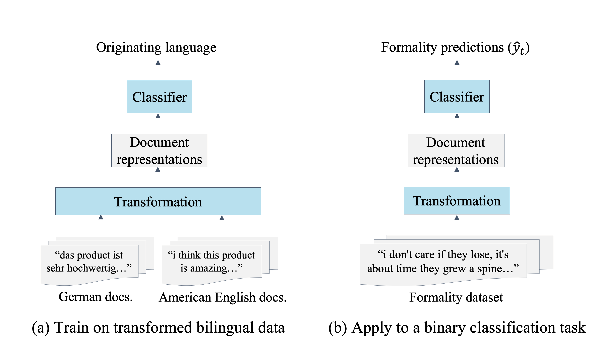

# CCTL
Data and code for "Cross-Cultural Transfer Learning for Text Classification" by Dor Ringel, Gal Lavee, Ido Guy and Kira Radinsky, EMNLP 2019

## Notes
 - (Oct 2019) we are still working on licensing the data so we can make it available.

## Cross-Cultural Transfer Learning for Text Classification


CCTL is a transfer-learning framework that leverages
widely-available unaligned bilingual corpora
for classification tasks, using no task-specific
data.

## Citation

### Cross-Cultural Transfer Learning for Text Classification

[1] D. Ringel, K. Radinsky, I. Guy and G. Lavee, [*Cross-Cultural Transfer Learning for Text Classification*](https://www.aclweb.org/anthology/D19-1400)

```
@inproceedings{ringel-etal-2019-cross,
    title = "Cross-Cultural Transfer Learning for Text Classification",
    author = "Ringel, Dor  and
      Lavee, Gal  and
      Guy, Ido  and
      Radinsky, Kira",
    booktitle = "Proceedings of the 2019 Conference on Empirical Methods in Natural Language Processing and the 9th International Joint Conference on Natural Language Processing (EMNLP-IJCNLP)",
    month = nov,
    year = "2019",
    address = "Hong Kong, China",
    publisher = "Association for Computational Linguistics",
    url = "https://www.aclweb.org/anthology/D19-1400",
    doi = "10.18653/v1/D19-1400",
    pages = "3864--3874"
}
```

Contact: [dorringel@cs.technion.ac.il](mailto:dorringel@cs.technion.ac.il)
